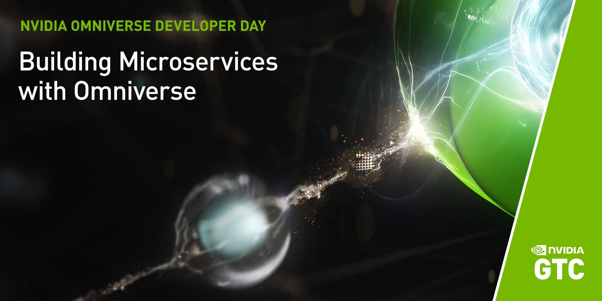

# Companion Code to *A Deep Dive into Building Microservices with Omniverse*

This companion code project contains the resources developed during the [*Deep Dive into Building Microservices with Omniverse*](https://events.rainfocus.com/widget/nvidia/nvidiagtc/sessioncatalog/session/1629317010811001jRq5) session presented during GTC November 2021.

While there is no better way to learn that to jump in an try writing your own microservice from the sample template for Kit extensions, we also know that having an example to get started can be a valuable resource. Our hope is that these sample extensions, along with the background information of the GTC session, will fast-forward you on your development journey in Omniverse.

[](https://events.rainfocus.com/widget/nvidia/nvidiagtc/sessioncatalog/session/1629317010811001jRq5)

Let us know about what this inspired you to create! [We'd love to hear from you!](https://forums.developer.nvidia.com/c/omniverse/showcase/362)

## About

This project contains the 2 extensions created during the conversation on microservices, which serve as a demonstration of the flexibility of this architecture.

Using the example of a 3D asset pipeline, these extensions illustrate the scalability and reusability of loosely coupled components by:
 1. **Creating a microservice to validate conformity of a USD scene.** This illustrates how a studio may scale and distribute automated tasks, allowing creators to focus on doing what they excel at, and relieve them from manual tasks.
 2. **Exposing a microservice to convert 3D assets from one format to another.** Independently from the previous microservice, this service can be configured to be as broad or as narrow as necessary to adapt to the needs a studio may have. Separate teams could even reuse and deploy the microservice to serve their unique needs: while artists may need UI integrated into their favorite content creation tools, pipeline developers may also automate the batch import of content shared by partners.
 3. **Assembling both services together and recording the status of conversion tasks.** By storing the result of conversion tasks in a database, one can imagine evolving this simple pipeline into an automated system exposing a dashboard where artists could monitor the status of their conversions tasks processing in the background, or adding features such as notifications when a task is completed.

## Configuration

To get started:
 1. Download a copy of this repository to your machine.
 2. From the [Omniverse Launcher](https://www.nvidia.com/en-us/omniverse), download *Create* and *Farm Queue*.

To load this project in *Create* (or any *Omniverse Kit*-based application such as *View*, *Machinima* or *Isaac Sim*), add a link from this repository to the application using the provided `link_app` script:

**On Windows:**
```batch
link_app.bat C:/Users/<username>/AppData/Local/ov/pkg/create-2021.3.7
```

**On Linux:**
```bash
./link_app.sh ~/.local/share/ov/pkg/create-2021.3.7
```

If the operation completed successfully, an *./app* folder should appear, linking the root of this repository to the install location of the Kit-based application from the Omniverse Launcher.

## Executing the sample

Once configured, this sample project can be executed by launching an instance of Create or any Kit-based application, and submitting a task to the endpoint exposed by the `omni.service.assets.convert` service.

**On Windows:**
```batch
REM Launch Create, with the extension enabled:
app/omni.create.bat ^
    --ext-folder C:\Users\<username>\AppData\Local\ov\pkg\farm-queue-102.1.0\exts-farm-queue ^
    --ext-folder ./exts ^
    --enable omni.services.assets.convert
```

**On Linux:**
```shell
# Launch Create, with the extension enabled:
./app/omni.create.sh \
    --ext-folder ~/.local/share/ov/pkg/farm-queue-102.1.0/exts-farm-queue \
    --ext-folder ./exts \
    --enable omni.services.assets.convert
```

Once the application is launched, a conversion task can be submitted to the service by using the web interface listing all the exposed microservices. This interactive interface is exposed at the following location:
 * For *Kit*: http://localhost:8011/docs
 * For *Create*: http://localhost:8111/docs
 * For *Isaac Sim*: http://localhost:8211/docs

## Additional resources

 * [NVIDIA Omniverse Platform](https://developer.nvidia.com/nvidia-omniverse-platform)
 * [NVIDIA Omniverse Developer Resource Center](https://developer.nvidia.com/nvidia-omniverse-developer-resource-center)
 * *Getting started* documentation:
   * [NVIDIA Omniverse Microservices](https://docs.omniverse.nvidia.com/services)
   * [NVIDIA Omniverse Farm](https://docs.omniverse.nvidia.com/farm)
